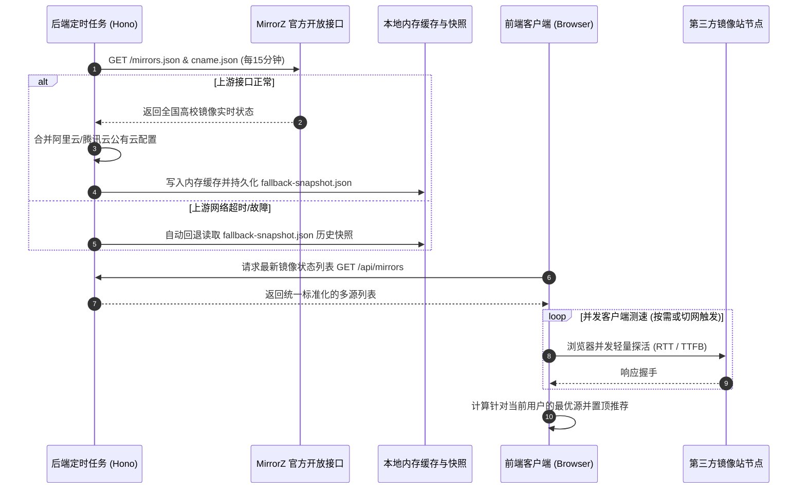

# 智能镜像导航与一站式开发环境配置平台 —— 规划与技术设计方案

## 1. 项目愿景与核心定位

### 1.1 核心痛点与定位
本项目定位为：
> **面向初学者与开发者的开源智能镜像导航、手把手依赖配置指南与优质资源共享平台。**

在传统软件镜像站和配置教程中，开发者（尤其是初学者）常常面临以下痛点：
- **高校/官方镜像站界面极客偏向严重**：纯表格排版、充斥大量晦涩系统术语（cname、upstream、sync status），新手甚至不知如何查找想要的内容；
- **教程过时、碎片化且缺乏验证**：网上海量博客命令残缺、环境不匹配，且缺少错误排查和回滚指南；
- **盲目换源导致速度不升反降**：不同用户处于电信、联通、移动或校园网（CERNET），服务器机房测速快并不代表用户端快；
- **配置操作心理负担大**：改了系统配置文件或环境变量后不知道改了哪、报错不敢动、无法一键还原。

**本平台的核心目标**：站在已有开源生态的肩膀上，不做重复的基础设施抓取，而是通过**极致现代与人性化的专业 UI/UX**、**高意图纯前端精准搜索**、**基于客户端视角的实时动态测速与网络感知**以及**手把手四步向导**，让用户在 30 秒内完成开发环境与依赖源的最优配置。

---

### 1.2 开源策略与工程模式
- **单仓管理（Monorepo）**：采用全栈统一代码仓开源。前端应用、轻量服务、共享类型包与开源数据模板统一存放在一个仓库中，任何开发者均可通过一条命令（如 `pnpm dev` 或 `docker compose up`）快速本地运行或私有化部署。
- **数据与逻辑彻底解耦**：镜像源规则、命令模板、排错知识库、推荐资源清单全部采用声明式静态数据（JSON / YAML / Markdown）维护。社区贡献者无需改动业务代码，只需提交一个 PR 添加配置项即可扩展新的语言生态或镜像源。

---

## 2. 开源生态协同与技术边界（拒绝重复造轮子）

为了避免无效重复开发，本项目明确界定技术边界，充分复用社区已有的优秀开源成果：

```text
       ┌─────────────────────────────────────────────────────────┐
       │                 上游开源生态 (直接复用)                  │
       │  • MirrorZ: mirrorz.json 规范、cname.json、各高校元数据API│
       │  • chsrc: 65+ 语言生态换源规则、配置文件路径定义          │
       │  • 商业公有云镜像: 阿里云/腾讯云/华为云公开镜像源数据    │
       └────────────────────────────┬────────────────────────────┘
                                    │
                                    ▼
       ┌─────────────────────────────────────────────────────────┐
       │                   本项目核心增量与特色                   │
       │  1. 专业开发者 UI/UX 体验 (严禁 Emoji、精致矢量、微动效)  │
       │  2. 纯前端零延迟精准搜索 (大搜索框上浮形变、拼音与意图)  │
       │  3. 客户端视角实时测速 (4层网络状态感知、SWR 无感刷新)   │
       │  4. 手把手交互式配置向导 (系统嗅探/验证自检/一键还原)    │
       │  5. 优质资源共享中心 (精选工具链/高速直链/教程沉淀)      │
       │  6. 智能化未来: LLM 意图解析 (自然语言转个性化装机方案)  │
       └─────────────────────────────────────────────────────────┘
```

### 2.1 充分复用 MirrorZ
- **镜像元数据接入**：直接请求并缓存 MirrorZ 的开放 API（如 `https://mirrors.mirrorz.org/`），获取清华、中科大、上交、浙大等 20+ 所高校镜像站的实时同步状态，**无需自行编写高校爬虫**。
- **统一命名体系**：复用 MirrorZ 的 `cname.json` 标准字典，统一解决各大源站路径命名不一致问题。
- **测速探针参考**：参考 MirrorZ 的 `site.big` 标准大文件规范作为测速候选目标。

### 2.2 吸收 chsrc 的规则沉淀
- 吸收 `chsrc` 对 65+ 种语言和操作系统的配置文件层级定义（如 Windows 下 `%APPDATA%\pip\pip.ini`、Linux/macOS 下 `~/.pip/pip.conf` 等），沉淀为平台内置的可视化配置数据字典。

### 2.3 补充商业云与加速节点
- 在高校源基础上补充阿里云、腾讯云、华为云、火山引擎等公有云镜像源，并在 DockerHub 加速、PyTorch CUDA 等特殊场景补全专属加速规则。

---

## 3. 当前第一阶段核心功能：智能镜像站与极致交互

本阶段集中精力打造四大核心体验：**严谨专业 UI/UX**、**高意图精准搜索（带平滑上浮形变动效）**、**客户端实时测速与多层网络状态感知**、**手把手配置指南**。

### 3.1 客户端视角（相对于用户）实时多维测速与网络感知

#### 核心机制
- **为什么必须客户端测速**：
  不同用户处于中国电信、联通、移动或教育网（CERNET），机房服务器到各镜像站的延迟与用户本地设备的延迟存在巨大差异。必须由**用户当前运行的浏览器前端**发起轻量探测，测算出的最优线路才是对用户真正有效的。
- **静默按需探活算法（Silent On-Demand Probe）**：
  1. 用户在搜索框聚焦、键入生态关键词或进入具体配置向导时，前端浏览器并发向支持该生态的候选镜像站发起轻量探活。
  2. 利用公共静态轻量资产（如 `favicon.ico` 或根目录 `robots.txt`），通过 `fetch(url, { mode: 'no-cors' })` 配合 `performance.now()` 计算真实 TCP 连接与首包往返耗时（RTT）。
  3. 单源超时熔断阈值默认设置为 1500ms，绝不阻塞用户界面渲染。
- **综合调度打分规则**：
  $$\text{综合得分} = 0.70 \times \text{客户端延迟分} + 0.20 \times \text{镜像站同步成功状态} + 0.10 \times \text{官方/商业稳定性加权}$$
  *注：若镜像站处于 `syncing` 或 `failed` 状态，系统自动降权并标记状态，防止推荐响应极快但内容过时的站点。*

#### 四层网络变动感知与缓存刷新策略（Multi-layer Network Invalidation）
测速结果会缓存至浏览器的 `localStorage` 中（默认有效时长 15 分钟），但如果用户在不同网络之间切换（例如校园网切手机热点、开/关代理软件），系统必须立即感知并废弃旧缓存：

1. **原生网络接口断连与切换监听**：
   - 监听 `window.addEventListener('online')`，在网络断开重连时触发重测；
   - 监听 `navigator.connection.addEventListener('change')`（NetworkInformation API），捕获 Wi-Fi 与蜂窝数据之间的介质切换。
2. **出口网络指纹校验（解决无缝切 Wi-Fi 与开/关代理痛点）**：
   - 后端提供极轻量微接口 `/api/net-fingerprint`，纯内存返回用户当前出口 IP 的网段哈希或 ASN（如 `{ hash: "a8f3...", isp: "CERNET" }`）；
   - 前端缓存测速数据时强制绑定该指纹。当页面重新获得焦点（`visibilitychange` / `window.onfocus`）时静默校验指纹。若指纹变化，立即将原有缓存置为失效并触发重新测速。
3. **SWR 机制（Stale-While-Revalidate，无感瞬时加载）**：
   - 存在有效缓存时，优先以 0 毫秒延时渲染界面；
   - 后台静默发起轻量二次探测，若新延迟与旧数据出现显著漂移（如变化 > 20ms 或最佳镜像排序反转），平滑过渡更新数字与徽标。
4. **显式矢量刷新按钮（用户自主控制）**：
   - 在测速状态面板旁放置单色矢量刷新图标（Lucide 图标库的 `RotateCw`），点击伴随 360° 微动效旋转并强制全量重新测速。

---

### 3.2 高意图纯前端精准搜索引擎

#### 架构实现：纯前端轻量检索引擎
- 采用 **MiniSearch** 或 **Fuse.js** 将生态、系统、镜像源别名字典预先加载至前端内存中；
- 避免频繁请求后端接口，实现**每敲一个字符 0ms 实时过滤与模糊匹配**。

#### 动效与交互流程规范
```text
[ 状态 0: 初始空态 (Idle State) ]
                   ┌────────────────────────────────────────┐
                   │  搜索生态、发行版或软件包...        [ / ] │  (居中沉浸式大搜索栏)
                   └────────────────────────────────────────┘
                                 │
                   用户开始键入字符 (Input Event)
                                 │
                                 ▼ (0.3s 贝塞尔曲线平滑上浮 + 尺寸收缩)
[ 状态 1: 激活搜索态 (Active State) ]
  ┌─────────────────────────────────────────────────────────┐
  │  py|                                              [Esc] │  (紧凑尺寸、平滑吸附偏上)
  └─────────────────────────────────────────────────────────┘
  ┌─────────────────────────────────────────────────────────┐
  │  > Python (pip)              官方包管理工具   [ 24ms 推荐 ]│  (平滑淡入展开候选结果)
  │    PyTorch                   深度学习框架     [ 32ms 极速 ]│
  │    Ubuntu ISO                Linux发行版      [ 45ms ]     │
  └─────────────────────────────────────────────────────────┘
```

- **搜索框平滑上滑动效（Spring-like Easing）**：
  - 初始无内容时，搜索框位于页面视觉重心（居中偏大，外层带极轻量呼吸边框）；
  - 检测到输入内容（`searchQuery.trim().length > 0`）瞬间，搜索框触发 CSS `transform: translateY(...)` 上移过渡，容器平滑收缩至紧凑导航条尺寸（动画曲线 `cubic-bezier(0.16, 1, 0.3, 1)`）；
  - 下方无缝展开模糊搜索预选卡片列表；按 `Esc` 或清空文字平滑回退至居中大搜索框。
- **全键盘极速流**：
  - 支持 `/` 或 `Ctrl + K` 随时全局唤起并聚焦；
  - 支持键盘方向键 `↓` / `↑` 高亮选择预选项，按 `Enter` 直接确认进入配置向导。
- **多层级别名与意图联想**：
  - 支持全拼音（`tengxun` 命中腾讯云，`huanyuan` 引导至换源总览）；
  - 支持自然生活化词汇（`装python`, `换源`, `下载linux`, `pytorch gpu加速`）；
  - **即搜即测**：候选卡片右侧即刻异步渲染该生态当前网络延迟与优选标签。

---

### 3.3 严格专业 UI / UX 人性化设计规范

#### 核心视觉原则：全站严禁 Emoji
项目致力于打造媲美顶级商业开发工具（如 Vercel、Linear、Raycast）的严肃、高级、极简质感，**前端界面坚决禁止出现任何 Emoji 表情符号**（避免不同操作系统间字体渲染风格不一致导致的廉价感）。

- **矢量图标体系**：
  全站采用 **`lucide-vue-next`** 统一线宽（1.5px / 2px）单色矢量图标库，配合官方标准 Mono SVG 品牌标识（Python, Node.js, Docker, Ubuntu, Apple, Windows, Linux）。
- **几何状态指示器（替代彩色 Emoji 圆点）**：
  - **最优推荐**：`w-1.5 h-1.5 rounded-full bg-emerald-500 ring-2 ring-emerald-500/20`，配文本 `24 ms` 与纯文字徽标 `推荐`；
  - **极速/良好**：`w-1.5 h-1.5 rounded-full bg-teal-500`，配文本 `38 ms`；
  - **一般/延迟较高**：`w-1.5 h-1.5 rounded-full bg-amber-500`，配文本 `142 ms`；
  - **异常/超时**：`w-1.5 h-1.5 rounded-full bg-zinc-400`，配文本 `超时`。
- **即时交互微动效**：
  - 代码一键复制：点击后图标由 `Copy` 矢量平滑变换为 `Check` 矢量，边框泛起极淡绿色高亮，1.5 秒后平滑复原；
  - 终端切换 Tab：点击即刻无感切换命令高亮，拒绝页面跳动。

---

### 3.4 手把手一站式依赖配置向导（核心闭环）

针对每个包管理器和软件生态，提供标准化的“四步向导闭环”，彻底解决新手不敢配、配不对的问题：

```text
  ┌─────────────────────────────────────────────────────────────┐
  │                   四步交互式配置向导                         │
  ├─────────────────────────────────────────────────────────────┤
  │ 步骤 1: 自动嗅探与系统选择                                   │
  │   • 自动检测当前 OS (Windows / macOS / Linux)               │
  │   • 终端切换：Windows (PowerShell) / Windows (CMD) / Bash   │
  ├─────────────────────────────────────────────────────────────┤
  │ 步骤 2: 测速推荐与配置生成                                   │
  │   • 默认勾选当前测速最优源 (支持下拉手动换其他站)           │
  │   • [临时换源命令]：适合单次安装测试                        │
  │   • [全局生效命令]：一键复制执行，永久配置                  │
  │   • [配置文件模式]：展示具体绝对路径与完整文件内容          │
  ├─────────────────────────────────────────────────────────────┤
  │ 步骤 3: 验证与自检 (Checklist)                              │
  │   • 给出验证命令 (如 pip config list)                       │
  │   • 明确指出：“若输出中包含推荐镜像地址，则表示成功”        │
  ├─────────────────────────────────────────────────────────────┤
  │ 步骤 4: 安全后悔药 (一键还原)                                │
  │   • 醒目提供“恢复官方默认源”撤销命令与还原验证              │
  │   • 彻底消除用户“改坏了电脑配置”的心理负担                  │
  └─────────────────────────────────────────────────────────────┘
```

- **高频排错卡片库（Troubleshooting Cards）**：
  在配置面板底部折叠关联常见报错排查指南：
  - *常见问题 1*：提示“不是内部或外部命令，也不是可运行的程序”怎么办？（附环境变量 PATH 配置指引）
  - *常见问题 2*：换源后报 SSL 证书错误（SSLError）怎么解决？（附带 `--trusted-host` 参数说明）
  - *常见问题 3*：权限不足（Permission Denied）如何处理？

---

## 4. 后续演进阶段（规划与接口预留）

在第一阶段完成核心镜像与配置闭环后，逐步开放以下两大特色模块：

### 4.1 优质资源共享中心
- **资源分类沉淀**：
  - **基础工具包**：MinGW-w64 离线解压免安装包、Git 优化安装器、JDK 多版本离线压缩包、VSCode 离线包。
  - **课程与实验套件**：高校计算机课程实验指导书、期末高频复习思维导图、标准化大作业代码骨架。
  - **开箱即用环境包**：Docker Compose 常见数据库一键启动模板、轻量 Python 虚拟环境脚手架。
- **多通道加速分发**：
  每个收录资源提供多个下载入口：`高校源直链`、`GitHub Release 代理加速`、`教育网盘备份（夸克/阿里/OneDrive）`，并严格标注 SHA256 校验码确保纯净无篡改。

### 4.2 LLM 智能需求识别系统
- **对话式意向问答（Smart Environment Agent）**：
  在首页顶部提供智能引导框：“输入你想做的事，AI 为你生成专属配置流水线”。
- **典型场景与输出**：
  - *用户输入*：“我是大一新生，想在 Win11 笔记本上用 VSCode 写 C 语言作业，该怎么配？”
  - *LLM 意向拆解与管线装配*：
    1. 自动生成任务清单：VSCode 下载 + MinGW-w64 工具包下载 + C/C++ 插件推荐；
    2. 生成针对当前系统最优的下载直链；
    3. 自动生成可以直接复制的 `tasks.json` 和 `launch.json` 预配置文件；
    4. 给出验证用 `hello.c` 源码与一键编译测试命令。

---

## 5. 技术架构选型：轻量解耦 Monorepo

经过评估，项目采用 **轻量解耦的 Monorepo（pnpm workspace）** 架构。该架构兼顾了“代码统一管理”、“前后端职责彻底解耦”、“前端支持纯静态脱机运行”以及“后端支持轻量扩展 LLM 与镜像缓存”的全部需求。

### 5.1 整体架构拓扑图

```text
               浏览器客户端 (用户本地终端)
       ┌──────────────────────────────────────────────┐
       │   前端应用 (apps/web) - 基于 Vue 3           │
       │   • 现代化无 Emoji 极简 UI (Tailwind CSS)     │
       │   • MiniSearch / Fuse.js 纯前端零延迟搜索     │
       │   • 搜索框平滑上移动效与尺寸收缩               │
       │   • 浏览器直连第三方镜像轻量并发测速探针       │
       │   • 4 层网络状态感知与 SWR 缓存刷新            │
       │   • 四步配置向导与命令一键生成                 │
       └───────┬───────────────────────────────┬──────┘
               │ 1. 客户端测速 (直连第三方)     │ 2. API 请求 (全功能模式下)
               ▼                               ▼
    ┌────────────────────┐            ┌────────────────────────────┐
    │  全国各大镜像站点   │            │   轻量后端 (apps/server)   │
    │  • 清华 / 科大 / 上交│            │   (基于 Node.js + Hono)    │
    │  • 阿里 / 腾讯 / 华为│            │                            │
    │  (测 RTT / TTFB)   │            │   • MirrorZ API 定时缓存   │
    └────────────────────┘            │   • 公有云源归一化合并     │
                                      │   • 容灾静态快照           │
                                      │   • 网络指纹与 LLM 智能网关│
                                      └─────────────┬──────────────┘
                                                    │
                                                    ▼
                                      ┌────────────────────────────┐
                                      │   核心数据层 (data/)       │
                                      │   • 声明式配置 JSON/YAML    │
                                      │   • 镜像源/生态/排错指南    │
                                      └────────────────────────────┘
```

---

### 5.2 子项目技术栈选型与职责划分

| 模块目录 | 技术选型 | 核心职责 | 特性与设计细节 |
| :--- | :--- | :--- | :--- |
| **`apps/web`**<br>(前端应用) | **Vite + TypeScript + Vue 3 + Tailwind CSS + Lucide Vue Next** | 界面呈现、交互引导、精准搜索、客户端测速 | **双模运行能力（Dual-Mode）**：<br>1. *单机静态模式*：脱离后端也能单机运行，完全在浏览器内跑测速、搜索与向导（直接读取内置数据）；<br>2. *全功能模式*：检测到后端在线时，自动获得定时同步的 MirrorZ 状态、网络指纹校验与 LLM 智能助理。 |
| **`apps/server`**<br>(轻量后端) | **Node.js + TypeScript + Hono (或 Fastify)** | 数据汇聚、缓存分发、网络指纹、LLM 网关 | **超轻量与高性能**：<br>• 使用 Hono 框架（毫秒级冷启动，原生 Web Fetch API，天然适配流式 SSE）；<br>• 定时任务（每 15-30 分钟）同步 MirrorZ 开放数据；<br>• 提供 `/api/net-fingerprint` 网络指纹校验；<br>• 保护 LLM API Key，处理流式请求。 |
| **`packages/shared`**<br>(共享类型与工具) | **TypeScript + Zod** | 共享类型定义、数据 Schema 校验、命令生成内核 | 前后端完全复用数据模型（`Mirror`、`Ecosystem`、`SpeedTestResult`），避免类型定义割裂。 |
| **`data/`**<br>(核心数据层) | **声明式 JSON / YAML / Markdown** | 生态配置、高校映射、排错指南、推荐资源 | 彻底与业务代码解耦，社区开发者提交 PR 仅需修改数据文件即可扩充生态或源站。 |

---

### 5.3 关键技术实现细节

#### 1. 客户端测速（跨域与探针方案）
由于直接使用 `fetch` 探测第三方镜像源可能会遇到浏览器跨域安全限制（CORS），系统采用复合探针策略：
- **方案 A（首选静态资源）**：请求各大源站约定的公共轻量静态资源（如 `favicon.ico` 或根目录 `robots.txt`），利用 `fetch(url, { mode: 'no-cors' })` 配合 `performance.now()` 计算真实 TCP 连接与握手往返耗时（RTT）。
- **方案 B（CORS 友好镜像）**：对于已开启 CORS 的镜像源（如部分高校和公有云），使用标准的 `HEAD` 请求精准获取 TTFB（首包时间）。
- **方案 C（深度带宽测试）**：仅在用户主动触发大文件测速时，使用 HTTP `Range: bytes=0-1048575` 下载 MirrorZ 规范中的 `site.big` 前 1MB 数据，计算瞬时带宽后立即中止。

#### 2. MirrorZ 开源数据引用与容灾缓存时序


---

### 5.4 单仓目录结构规范

```text
mirror-hub/
├── package.json                   # Monorepo 根配置 (pnpm-workspace)
├── pnpm-workspace.yaml            # 工作区定义 (apps/*, packages/*)
├── docker-compose.yml             # 一键容器化部署配置
├── README.md                      # 项目说明与一键启动指引
├── CONTRIBUTING.md                # 社区贡献指南 (PR 极简规则)
│
├── data/                          # 核心开源数据层 (纯声明式配置)
│   ├── mirrors.json               # 镜像站扩展定义 (公有云、特殊源)
│   ├── cname-map.json             # 别名映射与规范化字典
│   ├── ecosystems/                # 语言/系统换源规则 (pip, npm, apt...)
│   ├── resources/                 # 资源共享中心的收录清单与网盘链接
│   └── troubleshooting/           # 高频排错问答库
│
├── apps/
│   ├── web/                       # 前端项目 (Vite + TS + Vue 3 + Tailwind)
│   │   ├── src/
│   │   │   ├── components/        # 卡片、向导、测速徽标、终端切换组件
│   │   │   ├── pages/             # 首页、生态详情、资源中心
│   │   │   ├── services/          # 纯前端检索器、客户端测速器、网络监听器
│   │   │   └── hooks/             # 系统嗅探、剪贴板交互
│   │   └── vite.config.ts
│   │
│   └── server/                    # 轻量后端服务 (Node.js + Hono)
│       ├── src/
│       │   ├── cron/              # MirrorZ 定时抓取与缓存同步器
│       │   ├── routes/            # /api/mirrors, /api/net-fingerprint, /api/llm
│       │   └── index.ts           # 服务入口
│       └── tsconfig.json
│
└── packages/
    └── shared/                    # 前后端通用代码包
        ├── src/
        │   ├── types/             # Mirror, Ecosystem, ProbeResult 契约
        │   ├── schemas/           # Zod 数据校验 Schema
        │   └── generators/        # 配置命令与脚本生成工具函数
        └── package.json
```

---

## 6. 开发路线图（Roadmap）

```text
阶段 1: 核心破局与 MVP (当前重点)
  ├─ 搭建 pnpm workspace 单仓工程骨架 (apps/web[Vue 3] + apps/server[Hono] + packages/shared)
  ├─ 沉淀核心 JSON 数据层 (data/ecosystems 针对 pip, npm, apt, docker)
  ├─ 对接 MirrorZ API 汇聚与公有云镜像数据补充
  ├─ 实现纯前端轻量检索引擎与搜索框平滑上滑动效
  ├─ 实现前端无感并发客户端测速与 4 层网络状态感知算法
  └─ 完成核心生态手把手向导、终端选项卡切换与无 Emoji 现代专业 UI

阶段 2: 体验升级与生态扩充
  ├─ 扩充至 20+ 常用编程生态与系统源 (Maven, Cargo, Go, Arch Linux, Alpine 等)
  ├─ 完善全套排错自检库 (Troubleshooting) 与一键还原命令
  ├─ 全平台多终端适配 (PowerShell / CMD / Bash / Zsh)
  └─ 提供纯前端静态脱机导出模式 (Static SSG)

阶段 3: 资源共享中心上线
  ├─ 上线精选开发套件与课程实验资源专区
  ├─ 对接多通道加速与网盘转存直链
  └─ 开放社区资源提交与收录审核通道

阶段 4: LLM 智能体集成与正式开源
  ├─ 接入大模型 API，上线自然语言意图理解与装机方案装配引擎 (流式输出)
  ├─ 完善开源文档、Docker 一键部署包与 Contributor 贡献体系
  └─ 面向各大高校开源社区与全网公开发布
```