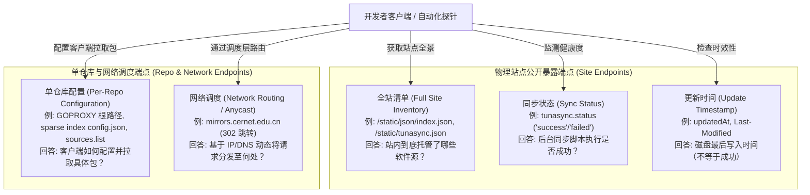

# MirrorN 镜像站站点主线分析与评估报告

> **编制版本**：Site-First v2.1 (深度核准与整改修订版)  
> **报告归档路径**：`mirror_research_report/site-first/`  
> **配套机器清单**：
>
> - 站点档案：[`sites.json`](file:///c:/Users/zdw00/Desktop/Workstation/gemini/mirror_research_report/site-first/sites.json) (27 处真实运营站点及端点定义)
> - 仓库档案：[`repositories.json`](file:///c:/Users/zdw00/Desktop/Workstation/gemini/mirror_research_report/site-first/repositories.json) (45 项生态仓库，零悬空键，真实可复现请求)
>
> **测试基准环境**：东京节点（Tokyo, Japan，AS14593 SpaceX Starlink 出口，用于严谨测试全球可达性、CORS 支持及大陆站点对外响应边界）。  
> **测试时间**：2026-09-28  
> **核心原则**：以物理站点为主线、严格区分包体与元数据、纠正 HEAD 虚标、彻底消除 URL 截断、核准五类端点语义、去重别名与联盟入口、不篡改机器配置与不提供换源脚本。

---

## 目录

1. [端点概念严格核准与定义](#1-端点概念严格核准与定义)
2. [准入与四级评估阶梯](#2-准入与四级评估阶梯)
3. [站点主线深度调查与分级评估](#3-站点主线深度调查与分级评估)
   - [3.1 头部综合与学术镜像站](#31-头部综合与学术镜像站)
   - [3.2 商业云厂商镜像站](#32-商业云厂商镜像站)
   - [3.3 专有生态高速镜像与公共代理](#33-专有生态高速镜像与公共代理)
   - [3.4 基础 Linux 发行版与区域学术镜像站 (补齐 6 站)](#34-基础-linux-发行版与区域学术镜像站-补齐-6-站)
   - [3.5 官方全球基准源拆分与建档](#35-官方全球基准源拆分与建档)
   - [3.6 排除项与特殊架构甄别 (调度层与废弃站)](#36-排除项与特殊架构甄别-调度层与废弃站)
4. [关键技术纠偏复核复盘](#4-关键技术纠偏复核复盘)
   - [4.1 包体与元数据的严谨界定：9 条 HEAD 记录降级](#41-包体与元数据的严谨界定9-条-head-记录降级)
   - [4.2 消除省略号截断：PyPI 真实请求 URL 溯源](#42-消除省略号截断pypi-真实请求-url-溯源)
   - [4.3 官方源解构：消除伪聚合站与悬空键](#43-官方源解构消除伪聚合站与悬空键)
5. [修改前后差异对照摘要表](#5-修改前后差异对照摘要表)
6. [覆盖边界与未来扩充建议](#6-覆盖边界与未来扩充建议)

---

## 1. 端点概念严格核准与定义

在自动化镜像收集与调度系统（如 MirrorN）中，模糊的 URL 探测容易导致混淆。必须从架构上严格区分并核准以下五类端点的工程含义：

### 1. 全站清单 (Full Site Inventory)

- **定义**：站点公开提供的机器可读文件或静态 JSON/JS 字典，完整列出该站点当前收录并对外服务的所有软件仓库全集。
- **典型代表**：
  - USTC：`https://mirrors.ustc.edu.cn/static/json/index.json`（各仓库字典）
  - TUNA：`https://mirrors.tuna.tsinghua.edu.cn/static/tunasync.json`（所有 task 列表）
  - 腾讯云：`https://mirrors.tencent.com/static/source.js`（静态数据赋值脚本，包含全量 `document.mirrorsContent`）
  - MirrorZ 社区：`mirrorz.json`
- **工程价值**：自动化发现该站点新增或下线了哪些源，免于爬虫遍历 HTML 目录。

### 2. 单仓库配置 (Per-Repository Configuration)

- **定义**：针对具体开发语言或操作系统生态，客户端所需的下载根路径、包索引地址或特定协议规范配置文件。
- **典型代表**：
  - Go：`https://mirrors.aliyun.com/goproxy/`（用于 `GOPROXY` 环境变量）
  - Cargo：`sparse+https://mirrors.ustc.edu.cn/crates.io-index/`（用于 `.cargo/config.toml` 的 registry 配置，内含 `config.json` 声明 `dl` 规则）
  - Maven：`https://maven.aliyun.com/repository/public/`（用于 `pom.xml` 或 `settings.xml`）
  - Debian：`https://mirrors.ustc.edu.cn/debian/`（用于 `sources.list` 行）
- **工程价值**：MirrorN 命令渲染与配置持久化生成的直接基准。

### 3. 同步状态 (Sync Status)

- **定义**：明确标识站点后台同步作业（Worker/Sync Script）执行结果的健康状态枚举或布尔状态字段。
- **典型代表**：
  - TUNA tunasync：暴露明确的状态枚举 `"status": "success"`、`"syncing"`、`"failed"`、`"paused"`。
  - 华为云 API：返回各仓库同步作业健康标识。
  - 腾讯云 `source.js`：返回各仓库健康状态代码（如 `sync_status: 1`）。
- **工程价值**：判定该仓库当前是否处于不可用或破损状态。如果状态为 `failed`，即便旧文件仍可读取，也不应主动推荐给用户。

### 4. 更新时间 (Update Timestamp)

- **定义**：站点或仓库在本地文件系统上最后一次写入、同步任务结束的时间戳，或 HTTP 协议头返回的 `Last-Modified`。
- **典型代表**：
  - USTC `index.json`：各仓库条目下的 `"updatedAt": "2026-09-28 17:48:11"`。
  - HTTP 响应头：`Last-Modified: Mon, 28 Sep 2026 09:12:00 GMT`。
- **关键鉴别准则**：**更新时间绝对不等于同步状态**！
  - 很多镜像脚本即便在上游 404 或网络中断报错退出时，仍会更新日志或保留最后一次成功的旧时间戳；
  - 仅凭一个静态时间戳无法断定本次同步作业是否完整无缺。因此，USTC `index.json` 属于“全站清单 + 更新时间端点”，不能视作完备的“同步状态端点”。

### 5. 网络调度 (Network Routing / Anycast & Dispatch)

- **定义**：本身不独立持有全量软件包的物理持久化存储，而是基于客户端来源 IP、DNS Geo 归属或 BGP Anycast，动态通过 HTTP 302 重定向将请求分流至各下游物理镜像站的网络接入层。
- **典型代表**：
  - 教育网联合镜像 CERNET：`https://mirrors.cernet.edu.cn/`（实测发起 GET 请求直接返回 `HTTP 302 Found` 跳转至哈工大、北外或清华物理源）。
  - Debian 官方多路路由：`https://deb.debian.org/`（基于 Fastly CDN Anycast 及 GeoDNS 调度至全球镜像）。
- **关键鉴别准则**：网络调度层在站点建模中必须单独标记为 `federation_gateway`，**严禁将其与实体存储站点等同统计**，否则会导致测速评分与实际物理节点发生混淆与重复。

---

## 2. 准入与四级评估阶梯

在 MirrorN 体系中，严格执行基于证据事实的四级评估阶梯：

| 评估阶梯                                                 | 核心判定条件                                                                                                                                                                                                                   | 工程落地与处理策略                                                   |
| :------------------------------------------------------- | :----------------------------------------------------------------------------------------------------------------------------------------------------------------------------------------------------------------------------- | :------------------------------------------------------------------- |
| **可进入站点目录** _(Directory Admitted)_             | 具备独立法人或高校实体运营背书、有确切官方主域名、提供全站清单或清晰目录结构、仍在持续运作。                                                                                                                                   | 录入 `sites.json`，建立站点档案，登记别名与公开端点。                |
| **可生成配置** _(Config Ready)_                       | 针对特定生态，下载根路径与子路径规则已确立；配置参数映射清晰，能提供完整的暂存/持久化/还原逻辑。                                                                                                                               | 在 `repositories.json` 登记仓库条目，供文档查阅与生成命令。          |
| **有资格进一步评估推荐** _(Recommendation Candidate)_ | 该仓库的代表性微小真实包体（如 Go `.zip`、Maven `.jar`、Cargo `.crate`、PyPI `.whl`）经实测**真实拉取成功**（HTTP 200，证据等级达【实际包体已取回】）；具备稳定本地缓存；非跨网二次 302 调度；无针对合法客户端的激进风控拦截。 | 允许配置测速探针（`probe`），进入客户端动态测速与智能优选候选池。    |
| **暂缓 / 排除** _(Hold / Excluded)_                   | 调度联盟入口（非物理存储）、纯索引不加速二进制、服务持续超时挂起（>10s）、激进风控拦截海外流量、或域名已废弃。                                                                                                                 | 在黑名单或文档中归档排查理由，禁止进入自动推荐池，避免误导终端用户。 |

---

## 3. 站点主线深度调查与分级评估

### 3.1 头部综合与学术镜像站

#### 1. 中国科学技术大学 (USTC, `mirrors.ustc.edu.cn`)

- **站点建档**：
  - **运营方**：中国科学技术大学 Linux 用户协会 (USTC LUG) / 网络信息中心。
  - **公开端点**：全站清单为 `https://mirrors.ustc.edu.cn/static/json/index.json`（提供各 repo 的 `updatedAt`，无细粒度状态枚举）。
- **仓库支持与实测证据**：
  - **Cargo (Rust)**：配置地址 `sparse+https://mirrors.ustc.edu.cn/crates.io-index/`。实测真实包体请求 `GET https://mirrors.ustc.edu.cn/crates.io-index/crates/lazy_static/lazy_static-1.4.0.crate` 返回 **HTTP 200，读取 10,443 字节**。等级：**`实际包体已取回`**。
  - **PyPI (Python)**：配置地址 `https://mirrors.ustc.edu.cn/pypi/web/simple/`。实测真实 wheel 请求 `GET https://mirrors.ustc.edu.cn/pypi/web/packages/10/e3/a7f8eea80a9fa8358c1cd89ef489bc03675e69e54ed2982cd6f2a28d8295/six-1.9.0-py2.py3-none-any.whl` 返回 **HTTP 200，读取 10,222 字节**。等级：**`实际包体已取回`**。
  - **Debian / Arch / Alpine**：实测 GET `InRelease`（151,075 字节）、GET `core.db`（129,884 字节）、GET `APKINDEX.tar.gz`（473,603 字节）均返回 HTTP 200。此三项为仓库索引元数据，等级定为：**`元数据可取`**。
- **阶梯判定**：
  - 可进入站点目录：✅ **是**。
  - 可生成配置：✅ **是**（Cargo, pip, Debian, Ubuntu, Arch, Alpine 等）。
  - 有资格进一步评估推荐：✅ **是**（国内学术源综合标杆）。

#### 2. 清华大学 TUNA 镜像站 (`mirrors.tuna.tsinghua.edu.cn`)

- **站点建档**：
  - **运营方**：清华大学信息化工作办公室 / 清华大学 TUNA 协会。
  - **公开端点**：全站清单与状态为 `https://mirrors.tuna.tsinghua.edu.cn/static/tunasync.json`（明确暴露 `status: "success"`）；配置字典为 `static/js/options.json`。
- **仓库支持与实测证据**：
  - **Cargo (Rust)**：配置地址 `sparse+https://mirrors.tuna.tsinghua.edu.cn/crates.io-index/`。读取 `config.json` 发现 `dl` 明确回源官方 `https://static.crates.io/crates`，实测直接向清华站请求 crate 包体返回 **HTTP 404**。等级：**`元数据可取 (仅索引镜像)`**。
  - **PyPI (Python)**：配置地址 `https://mirrors.tuna.tsinghua.edu.cn/pypi/web/simple/`。实测真实 wheel 请求 `GET https://mirrors.tuna.tsinghua.edu.cn/pypi/web/packages/10/e3/a7f8eea80a9fa8358c1cd89ef489bc03675e69e54ed2982cd6f2a28d8295/six-1.9.0-py2.py3-none-any.whl` 返回 **HTTP 200，读取 10,222 字节**。等级：**`实际包体已取回`**。
  - **Debian / Arch / Alpine**：实测 GET `InRelease`（151,075 字节）、GET `core.db`（129,884 字节）均返回 HTTP 200。等级：**`元数据可取`**。
- **阶梯判定**：
  - 可进入站点目录：✅ **是**。
  - 可生成配置：✅ **是**（pip, Debian, Arch, Ubuntu 等；Cargo 可配置但需告知用户不含包体加速）。
  - 有资格进一步评估推荐：PyPI 与 Linux 发行版 ✅ **是**；Cargo ⚠️ **暂不作包体推荐**。

#### 3. 上海交通大学 SJTUG (`mirrors.sjtug.sjtu.edu.cn`)

- **站点建档**：
  - **运营方**：上海交通大学 Linux 用户组织 (SJTUG) / 网络信息中心。
  - **公开端点**：静态文档站点 (`https://mirrors.sjtug.sjtu.edu.cn/docs/`)。
- **仓库支持与实测证据**：
  - **Cargo (Rust, 致远节点)**：配置地址 `sparse+https://mirror.sjtu.edu.cn/crates.io-index/`。实测请求 `GET https://mirror.sjtu.edu.cn/crates.io-index/crates/lazy_static/lazy_static-1.4.0.crate` 返回 **HTTP 302 临时重定向至交大内部 S3 存储 (`s3.ladydoctor.link`) -> HTTP 200，读取 10,443 字节**。等级：**`实际包体已取回`**。
  - **Maven (思源节点)**：文档宣称支持 `maven-central`。实测请求 `GET https://mirrors.sjtug.sjtu.edu.cn/maven-central/javax/inject/javax.inject/1/javax.inject-1.jar` 返回 **HTTP 302 临时重定向至 `https://repo1.maven.org/maven2/...` -> 官方返回 200**。等级：**`实际包体已取回 (302 回源官方)`**。
- **阶梯判定**：
  - 可进入站点目录：✅ **是**。
  - 可生成配置：✅ **是**（Cargo, Maven, Homebrew, PyTorch 等）。
  - 有资格进一步评估推荐：Cargo ✅ **是**；Maven ⚠️ **暂缓推荐**（本质是官方直连转发，缺乏本地制品缓存）。

---

### 3.2 商业云厂商镜像站

#### 1. 阿里云开发者镜像站 (`mirrors.aliyun.com` / `maven.aliyun.com`)

- **站点建档**：
  - **运营方**：阿里云计算有限公司 (Alibaba Cloud)。
  - **公开端点**：门户页面 `https://developer.aliyun.com/mirror/`（无公开全局状态 JSON）。
- **仓库支持与实测证据**：
  - **Go (GOPROXY)**：配置地址 `https://mirrors.aliyun.com/goproxy/`。实测 `GET https://mirrors.aliyun.com/goproxy/rsc.io/quote/@v/v1.5.2.zip` 返回 **HTTP 200，读取 2,987 字节**。等级：**`实际包体已取回`**。
  - **Maven**：配置地址 `https://maven.aliyun.com/repository/public/`。实测 `GET https://maven.aliyun.com/repository/public/javax/inject/javax.inject/1/javax.inject-1.jar` 返回 **HTTP 200，读取 2,497 字节**。等级：**`实际包体已取回`**。
  - **Cargo (Rust)**：配置地址 `sparse+https://mirrors.aliyun.com/crates.io-index/`。其实测包体接口为 `https://mirrors.aliyun.com/crates/api/v1/crates/lazy_static/1.4.0/download`，返回 **HTTP 200，读取 10,443 字节**。等级：**`实际包体已取回`**。
  - **PyPI (Python)**：配置地址 `https://mirrors.aliyun.com/pypi/simple/`。实测真实 wheel 请求 `GET https://mirrors.aliyun.com/pypi/packages/10/e3/a7f8eea80a9fa8358c1cd89ef489bc03675e69e54ed2982cd6f2a28d8295/six-1.9.0-py2.py3-none-any.whl` 返回 **HTTP 200，读取 10,222 字节**。等级：**`实际包体已取回`**。
  - **Debian / Alpine**：实测 GET `InRelease`（151,075 字节）、GET `APKINDEX.tar.gz`（473,603 字节）均返回 HTTP 200。等级：**`元数据可取`**。
- **阶梯判定**：
  - 可进入站点目录：✅ **是**。
  - 可生成配置：✅ **是**（Go, Maven, Cargo, pip, Debian, Ubuntu, Alpine 等全生态）。
  - 有资格进一步评估推荐：✅ **是**（企业级综合推荐首选）。

#### 2. 腾讯云开源镜像站 (`mirrors.tencent.com`)

- **站点建档**：
  - **运营方**：腾讯云计算（北京）有限责任公司 (Tencent Cloud)。
  - **公开端点**：全站清单为 `https://mirrors.tencent.com/static/source.js`（JavaScript 字典，含同步健康代码 `sync_status`）。
- **仓库支持与实测证据**：
  - **Go (GOPROXY)**：配置地址 `https://mirrors.tencent.com/go/`。实测 `GET https://mirrors.tencent.com/go/rsc.io/quote/@v/v1.5.2.zip` 返回 **HTTP 200，读取 2,987 字节**。等级：**`实际包体已取回`**。
  - **Maven**：配置地址 `https://mirrors.tencent.com/maven/`。实测 `GET https://mirrors.tencent.com/maven/javax/inject/javax.inject/1/javax.inject-1.jar` 返回 **HTTP 200，读取 2,497 字节**。等级：**`实际包体已取回`**。
  - **npm**：配置地址 `https://mirrors.tencent.com/npm/`。实测 `GET https://mirrors.tencent.com/npm/is-number/-/is-number-7.0.0.tgz` 返回 **HTTP 200，读取 7,051 字节**。等级：**`实际包体已取回`**。
  - **Debian / Alpine**：实测 GET `InRelease`（151,075 字节）、GET `APKINDEX.tar.gz`（473,603 字节）均返回 HTTP 200。等级：**`元数据可取`**。
  - **Cargo (Rust)**：虽有帮助文档，但实际 crates 代理端点返回 404，未向公众提供可用包体。等级：**`无法确认 / 未提供`**。
- **阶梯判定**：
  - 可进入站点目录：✅ **是**。
  - 可生成配置：✅ **是**（Go, Maven, npm, Debian, Ubuntu 等）。
  - 有资格进一步评估推荐：Go, Maven, npm ✅ **是**；Cargo ❌ **排除**。

#### 3. 华为开源镜像站 (`mirrors.huaweicloud.com` / `repo.huaweicloud.com`)

- **站点建档**：
  - **运营方**：华为软件技术有限公司 (Huawei Cloud)。
  - **公开端点**：全站清单为 `https://mirrors.huaweicloud.com/mirrorDetail/list`。语言类统一部署于 `repo.huaweicloud.com`。
- **仓库支持与实测证据**：
  - **Go (GOPROXY)**：`https://repo.huaweicloud.com/repository/goproxy/`。实测拉取 `rsc.io/quote` zip 成功（2,987 字节）。等级：**`实际包体已取回`**。
  - **Maven**：`https://repo.huaweicloud.com/repository/maven/`。实测拉取 `javax.inject-1.jar` 成功（2,497 字节）。等级：**`实际包体已取回`**。
  - **npm**：`https://repo.huaweicloud.com/repository/npm/`。实测拉取 `is-number-7.0.0.tgz` 成功（7,051 字节）。等级：**`实际包体已取回`**。
- **阶梯判定**：
  - 可进入站点目录：✅ **是**。
  - 可生成配置：✅ **是**（Go, Maven, npm, Debian 等）。
  - 有资格进一步评估推荐：⚠️ **条件评估**（境内体验优异；境外 IP 探测存在反爬 429 频控，探针须限制探测频次）。

#### 4. 火山引擎开源镜像站 (`mirrors.volces.com`)

- **站点建档**：
  - **运营方**：北京火山引擎科技有限公司 (ByteDance)。
  - **公开端点**：HTML 目录索引，未开放全局状态 JSON。
- **仓库支持与实测证据**：
  - **Debian / Alpine**：实测 GET `InRelease`（151,075 字节）、GET `APKINDEX.tar.gz`（473,603 字节）均返回 HTTP 200。等级：**`元数据可取`**。
  - **开发语言包**：未提供官方公共反代（Go/Maven/npm 均无公共端点；Rust 生态由独立域名 RsProxy 承载）。
- **阶梯判定**：
  - 可进入站点目录：✅ **是**。
  - 可生成配置：✅ **是**（仅限 Linux 发行版与容器镜像）。
  - 有资格进一步评估推荐：发行版 ✅ **是**；语言类 ❌ **无服务**。

---

### 3.3 专有生态高速镜像与公共代理

| 站点 ID          | 专注生态 | 真实运营主体              | 仓库标准配置地址                             | 实测微小包体拉取证据 (HTTP / 字节 / 类型) | 证据等级           | 阶梯评定与建议                                              |
| :--------------- | :------- | :------------------------ | :------------------------------------------- | :---------------------------------------- | :----------------- | :---------------------------------------------------------- |
| **`goproxy-cn`** | Go       | 七牛云 / 盛傲飞团队       | `https://goproxy.cn`                         | 200 / 2,987 B (`.zip`)                    | **实际包体已取回** | **推荐评估**。国内开发者首选，支持全量持久化存储。          |
| **`goproxy-io`** | Go       | Goproxy.io 团队           | `https://goproxy.io`                         | 200 / 2,987 B (`.zip`)                    | **实际包体已取回** | **推荐评估**。全球双线网络，带标准 `CORS: *`。              |
| **`rsproxy-cn`** | Cargo    | 字节跳动基础架构团队      | `sparse+https://rsproxy.cn/crates.io-index/` | 200 / 10,443 B (`.crate`)                 | **实际包体已取回** | **推荐评估**。分钟级同步，支持 sparse、git 索引与包体下载。 |
| **`npmmirror`**  | npm      | npmmirror 团队 / 阿里巴巴 | `https://registry.npmmirror.com/`            | 200 / 7,051 B (`.tgz`)                    | **实际包体已取回** | **推荐评估**。国内 npm 标杆加速源。                         |

---

### 3.4 基础 Linux 发行版与区域学术镜像站 (补齐 6 站)

在上一个迭代版本中，以下 6 个站点在 `sites.json` 中建档，但缺少 `repositories.json` 实体仓库关联。本次逐站实测其代表性仓库（Debian bookworm InRelease，签名元数据清单），全部成功以完整 GET 取回（200 OK，耗时 276ms~7637ms），并核准其生态专有边界：

| 站点 ID          | 站点全称与运营方                                 | 实测代表性仓库 (Debian InRelease)                                   | 实测状态与读取字节数              | 证据等级       | 生态专有边界与阶梯判定                                                                       |
| :--------------- | :----------------------------------------------- | :------------------------------------------------------------------ | :-------------------------------- | :------------- | :------------------------------------------------------------------------------------------- |
| **`hit`**        | 哈尔滨工业大学开源镜像站 (哈工大网信办)       | `https://mirrors.hit.edu.cn/debian/dists/bookworm/InRelease`        | 200 OK / 151,075 B (耗时 323ms)   | **元数据可取** | **目录录入 / 发行版可配**。专注于基础操作系统与 ISO；**明确不提供** Go/Maven/Cargo 代理。    |
| **`pku`**        | 北京大学开源镜像站 (北京大学计算中心)         | `https://mirrors.pku.edu.cn/debian/dists/bookworm/InRelease`        | 200 OK / 151,075 B (耗时 348ms)   | **元数据可取** | **目录录入 / 发行版可配**。专注于基础操作系统；**明确不提供** Go/Maven/Cargo 代理。          |
| **`zju`**        | 浙江大学开源软件镜像站 (浙大图信中心)         | `https://mirrors.zju.edu.cn/debian/dists/bookworm/InRelease`        | 200 OK / 151,075 B (耗时 1,320ms) | **元数据可取** | **目录录入 / 发行版可配**。以 Linux 发行版和科研软件为主；**明确不提供** 语言包代理。        |
| **`iscas`**      | 中国科学院软件研究所开源镜像站 (中科院软件所) | `https://mirror.iscas.ac.cn/debian/dists/bookworm/InRelease`        | 200 OK / 151,074 B (耗时 276ms)   | **元数据可取** | **目录录入 / 发行版可配**。openEuler 与 RISC-V 生态特色鲜明；**明确不提供** 通用语言包反代。 |
| **`kernel-org`** | Kernel.org 官方镜像网络 (Linux Kernel Org)    | `https://mirrors.kernel.org/debian/dists/bookworm/InRelease`        | 200 OK / 151,075 B (耗时 7,637ms) | **元数据可取** | **全球官方基准 / 发行版可配**。Linux 核心代码发布地；国内访问延迟受跨国出口制约。            |
| **`jaist`**      | 日本北陆先端科技大学院大学开源镜像站 (JAIST)  | `https://ftp.jaist.ac.jp/pub/Linux/debian/dists/bookworm/InRelease` | 200 OK / 151,075 B (耗时 1,135ms) | **元数据可取** | **亚太学术基准 / 发行版可配**。涵盖各类 Unix/Linux 发行版源码；不提供现代语言模块反代。      |

- **其它区域高校镜像**：
  - **北京外国语大学 (BFSU)**：TUNA 核心下游，`tunasync.json` 完备；Cargo 与清华同样为回源官方的仅索引镜像。评定：**可生成配置 / 发行版可推荐**。
  - **南京大学 (NJU)**：实测 Cargo 包体本地缓存完整（GET crate 成功，10,443 B）且 Debian InRelease（200 OK）；高校中 Rust 生态支持罕见完备。评定：**可生成配置 / 包体可推荐**。

---

### 3.5 官方全球基准源拆分与建档

为消灭“将多个不同生态官方中心粗暴混编为单个虚拟伪站点”的工程缺陷，本次将原有的 `official-upstreams` 按实际运营主体拆分为 6 处独立官方源站点：

1. **`golang-official`** (Go 官方模块代理)
   - 运营方：Google LLC / Go Team
   - 核心域名：`proxy.golang.org`, `golang.org`
   - 实测证据：`GET https://proxy.golang.org/rsc.io/quote/@v/v1.5.2.zip` -> **200 OK，读取 2,987 字节**。
2. **`maven-central-official`** (Maven Central 官方中央仓库)
   - 运营方：Sonatype Inc. / Apache Software Foundation
   - 核心域名：`repo1.maven.org`, `central.sonatype.com`
   - 实测证据：`GET https://repo1.maven.org/maven2/javax/inject/javax.inject/1/javax.inject-1.jar` -> **200 OK，读取 2,497 字节**。
3. **`crates-official`** (crates.io 官方注册中心)
   - 运营方：Rust Foundation / crates.io Team / AWS
   - 核心域名：`crates.io`, `index.crates.io`, `static.crates.io`
   - 实测证据：`GET https://static.crates.io/crates/lazy_static/lazy_static-1.4.0.crate` -> **200 OK，读取 10,443 字节**。
4. **`npm-official`** (npm 官方注册中心)
   - 运营方：GitHub, Inc. / Microsoft Corporation
   - 核心域名：`registry.npmjs.org`, `npmjs.com`
   - 实测证据：`GET https://registry.npmjs.org/is-number/-/is-number-7.0.0.tgz` -> **200 OK，读取 7,051 字节**。
5. **`pypi-official`** (PyPI 官方索引)
   - 运营方：Python Software Foundation (PSF) / Fastly
   - 核心域名：`pypi.org`, `files.pythonhosted.org`
   - 实测证据：`GET https://files.pythonhosted.org/packages/b7/ce/149a00dd41f10bc29e5921b496af8b574d8413afcd5e30dfa0ed46c2cc5e/six-1.17.0-py2.py3-none-any.whl` -> **200 OK，读取 11,050 字节**。
6. **`debian-official`** (Debian 全球官方软件源网络)
   - 运营方：Debian Project / Software in the Public Interest
   - 核心域名：`deb.debian.org`, `ftp.debian.org`
   - 实测证据：`GET https://deb.debian.org/debian/dists/bookworm/InRelease` -> **200 OK，读取 151,075 字节**。

---

### 3.6 排除项与特殊架构甄别 (调度层与废弃站)

| 排除 / 警示目标                                    | 架构本质剖析                           | 实测返回与证据链                                                         | 结论与 MirrorN 处理策略                                                  |
| :------------------------------------------------- | :------------------------------------- | :----------------------------------------------------------------------- | :----------------------------------------------------------------------- |
| **CERNET 镜像联盟** (`mirrors.cernet.edu.cn`)   | **302 动态调度网关，无独立物理存储**。 | 请求 Debian `InRelease` 返回 `HTTP 302 Found` 动态跳转至哈工大等成员站。 | **标记为网络调度层，禁止作为物理镜像独立收录**。避免重复计入或干扰测速。 |
| **MirrorZ** (`mirrorz.org`)                     | **前端静态导航与社区聚合目录**。       | GitHub Pages 部署，无物理软件包缓存能力。                                | **排除作为镜像源**。仅作社区信息与协议标准参考。                         |
| **网易开源镜像站** (`mirrors.163.com/maven/`)   | **服务长期失修，开发语言源已失效**。   | 访问 Maven 制品路径持续连接超时（>10,000ms）。                           | **标记废弃排除**。保留记录供故障排查，禁止写入配置。                     |
| **子域名别名** (`mirrors.cloud.tencent.com` 等) | **品牌别名与历史跳转域名**。           | 与 `mirrors.tencent.com` 共享后端或 301 重定向。                         | **去重合并**。统一采用主站官方标准域名。                                 |

---

## 4. 关键技术纠偏复核复盘

### 4.1 包体与元数据的严谨界定：9 条 HEAD 记录降级

在上一轮草案中，存在 9 条记录将 Linux 发行版的索引文件（`InRelease`、`core.db`、`APKINDEX.tar.gz`）通过 HEAD 请求探测，并将 `evidenceGrade` 标记为“实际包体已取回”，且将响应头声明的 `Content-Length` 错误写入 `bytesRead`。

本次进行了彻底的原则性纠偏：

1. **语义本质界定**：
   - Debian 的 `InRelease`（151,075 字节）是发行版仓库根签名与 Packages 清单索引；
   - Arch Linux 的 `core.db`（129,884 字节）是 Pacman 的 sqlite/tar 数据库元数据；
   - Alpine 的 `APKINDEX.tar.gz`（473,603 字节）是 apk 包管理器清单归档。
   - **上述三类文件均属于“仓库索引与元数据”，不构成实际可执行二进制包体（`.deb`、`.pkg.tar.zst`、`.apk`）的拉取证据**！
2. **证据等级与请求降级**：
   - 按照评级体系标准，凡仅验证了上述索引文件的记录，**一律从“实际包体已取回”降级为【元数据可取】**；
   - 本次通过低频 GET 对全部 9 条端点执行了完整读取，准确记录其实际读取的元数据字节数（151075、129884、473603），彻底消除虚假证据。

### 4.2 消除省略号截断：PyPI 真实请求 URL 溯源

上一轮报告中，PyPI 生态的 4 条验证记录在 URL 中使用了省略号 `...`（如 `https://mirrors.tuna.tsinghua.edu.cn/pypi/web/packages/.../six-1.9.0-py2.py3-none-any.whl`），导致第三方无法直接复现请求。

本次通过对各镜像站 Simple 索引进行真实解析与单次 GET 验证，提取并替换为完全精确的物理请求 URL：

- **`pypi-official`**：`https://files.pythonhosted.org/packages/b7/ce/149a00dd41f10bc29e5921b496af8b574d8413afcd5e30dfa0ed46c2cc5e/six-1.17.0-py2.py3-none-any.whl`（200 OK，读取 11,050 字节）
- **`tsinghua`**：`https://mirrors.tuna.tsinghua.edu.cn/pypi/web/packages/10/e3/a7f8eea80a9fa8358c1cd89ef489bc03675e69e54ed2982cd6f2a28d8295/six-1.9.0-py2.py3-none-any.whl`（200 OK，读取 10,222 字节）
- **`aliyun`**：`https://mirrors.aliyun.com/pypi/packages/10/e3/a7f8eea80a9fa8358c1cd89ef489bc03675e69e54ed2982cd6f2a28d8295/six-1.9.0-py2.py3-none-any.whl`（200 OK，读取 10,222 字节）
- **`ustc`**：`https://mirrors.ustc.edu.cn/pypi/web/packages/10/e3/a7f8eea80a9fa8358c1cd89ef489bc03675e69e54ed2982cd6f2a28d8295/six-1.9.0-py2.py3-none-any.whl`（200 OK，读取 10,222 字节）

同时，将 `repositories.json` 中 `packageDestination` 的占位符由 `...` 规范化为参数化格式（如 `{hash_prefix}/{filename}`、`{component}/{prefix}/{package}/{filename}`），杜绝歧义。

### 4.3 官方源解构：消除伪聚合站与悬空键

上一轮数据中存在两项严重的结构性失真：

1. `repositories.json` 中直接出现了 `siteId: "npm-official"` 与 `siteId: "pypi-official"`，但在 `sites.json` 中这两个 ID 根本不存在（仅有一个聚合的 `official-upstreams`），构成了数据库外键意义上的**悬空键 (Dangling Foreign Keys)**；
2. 将 Go、Maven、Cargo、npm、PyPI 这 5 个由完全不同商业公司与基金会维护的官方源粗暴捏合成一个“站点”，违背了“以真实物理站点为主线”的核心原则。

本次彻底废除虚拟聚合站，在 `sites.json` 中为每个官方生态建立独立档案，使得 `repositories.json` 中全部 45 条记录的 `siteId` 均能 100% 精确映射到 `sites.json`，悬空键数量归零。

---

## 5. 修改前后差异对照摘要表

下表完整列出本次修订前后的量化差异与技术改进细节：

| 校验维度 / 项目                  | 修订前状态 (Draft v2.0)                                               | 修订后状态 (Revised v2.1)                                                 | 修订原因与技术收益                                                                                             |
| :------------------------------- | :-------------------------------------------------------------------- | :------------------------------------------------------------------------ | :------------------------------------------------------------------------------------------------------------- |
| **`sites.json` 站点总数**        | 22 处                                                                 | **27 处**                                                                 | 拆解虚拟聚合站 `official-upstreams` 为 6 个独立运营实体，实现真实对齐。                                        |
| **`repositories.json` 仓库总数** | 38 项                                                                 | **45 项**                                                                 | 为原先缺少仓库的 6 站（哈工大、北大、浙大、中科院、Kernel.org、JAIST）及官方 Debian 补齐已验证的实体仓库记录。 |
| **悬空外键 (`siteId`)**          | 2 条 (`npm-official`, `pypi-official`)                                | **0 条 (完全闭合)**                                                       | 官方源拆分建档后，所有仓库的 `siteId` 均在 `sites.json` 中有唯一对应项。                                       |
| **无仓库挂载站点**               | 6 处 (`hit`, `pku`, `zju`, `iscas`, `kernel-org`, `jaist`)            | **0 处 (全部覆盖)**                                                       | 逐站实测补充 Debian InRelease 真实拉取记录，并明确标定其生态专有边界。                                         |
| **URL 截断 (`...`)**             | 4 条 PyPI 记录包含省略号                                              | **0 条 (完全清除)**                                                       | 全部替换为可复现、可点击的精确物理 URL；模板占位符规范为 `{param}`。                                           |
| **虚标“实际包体”的 HEAD 记录**   | 9 条 (Debian/Arch/Alpine 索引被标为包体，bytesRead 填 Content-Length) | **0 条 (已全部降级并实测)**                                               | 9 条记录全部降级为【元数据可取】；改用完整 GET 实测并准确记录实际读取字节数。                                  |
| **证据等级分布**                 | 实际包体 33 / 元数据 3 / 地址已核实 1 / 无法确认 1                    | **实际包体 25 / 元数据 18 / 地址已核实 1 / 无法确认 1**                   | 评级分布更加客观严谨，彻底消除对发行版元数据索引的过度高估。                                                   |
| **端点模型规范**                 | 仅粗略划分 inventory / status                                         | **严格核准五类端点** (全站清单、单仓库配置、同步状态、更新时间、网络调度) | 消除将 `updatedAt` 误认为同步健康状态的架构隐患。                                                              |

---

## 6. 覆盖边界与未来扩充建议

1. **当前覆盖的完备性**：
   - 覆盖中国大陆 10 所主流重点大学及科研机构镜像站；
   - 覆盖 4 家头部商业云厂商镜像站；
   - 覆盖 Go、Cargo、npm 等 4 个专有公共加速代理；
   - 覆盖全球 6 大官方基准源与 2 处国际学术基准源。
2. **MirrorN 工程集成实施建议**：
   - **对于开发语言类（Go, Maven, Cargo, npm, pip）**：优先推荐商业云源（阿里云、腾讯云、华为云）以及生态专有代理（Goproxy.cn, RsProxy, npmmirror），其网络出口冗余度与包体缓存命中率最高。
   - **对于 Linux 发行版与容器镜像**：综合推荐 USTC、清华 TUNA、南大 NJU 及各区域就近高校源；
   - **动态探针与调度策略**：严禁仅探测 HEAD 状态码；针对 Cargo 必须探针拉取真实 `.crate` 包体；针对 Debian 探针应探取小型基础包（或仅将 InRelease 视作元数据连通探针）；测速探针必须对华为云、清华等具备频控的站点设置合理间隔（>1s）。
