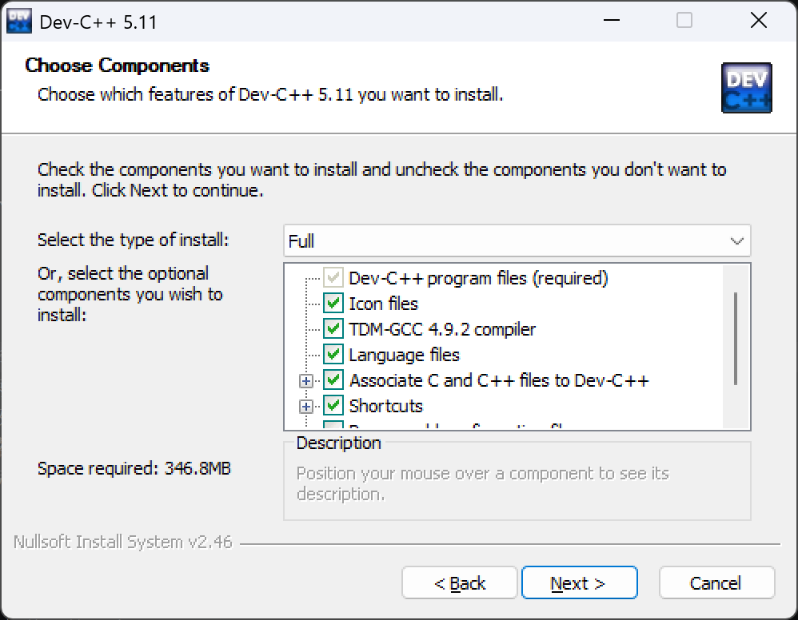

## 下载 Dev-C++

**如果老师给了版本号或安装包，就与课程保持一致。** 学校之间的要求并不统一。下面两个安装包都包含编译器，不需要另外安装 GCC。

:::notice{type="note"}
Dev C++ 缺点：编辑器老旧且调试体验一般，如果你期望更好的编写体验，推荐使用<>[VSCode](/resources/vscode/)/<>[Visual Studio](/resources/visual-studio/)，非 Dev-C++ 的替代版本
:::

| 版本 | 如何选择 |
| --- | --- |
| Dev-C++ 5.11（旧版） | 课程或机房明确使用 5.11 时，蓝桥杯比赛环境 |
| Dev-C++ 6.3（最新版） | 需要传统 Dev-C++ 且课程未限定旧版时可选 |

### Dev-C++ 5.11（推荐）

::download{source="orwell-setup" label="下载 Dev-C++ 5.11（含编译器）"}

### Dev-C++ 6.3

::download{source="embarcadero-setup" label="下载 Dev-C++ 6.3（含编译器）"}

## 安装与首次启动

:::steps
1. 安装时没有中文选项，选择英文即可。
2. 运行下载的安装程序，依赖配置按照默认勾选情况即可。
   
3. 安装到简单的英文目录，例如 `D:\Dev-Cpp`，旧版尤其应避免中文或特殊字符路径。
4. 首次启动选择界面语言；若语言向导乱码，先用 English 完成设置，再修改语言。
5. 新建源代码文件，保存后完成下面的编译测试（可选）。
:::

## 编译第一个程序

::::choice{label="选择正在学习的语言"}
:::option{label="C 语言（.c）"}
保存为 `hello.c`。

```c title="hello.c"
#include <stdio.h>

int main(void) {
    printf("Hello, World!\n");
    return 0;
}
```
:::
:::option{label="C++（.cpp）"}
保存为 `hello.cpp`。

```cpp title="hello.cpp"
#include <iostream>

int main() {
    std::cout << "Hello, World!\n";
    return 0;
}
```
:::
::::

保存文件后选择 **编译并运行**。传统 Dev-C++ 通常使用 `F11`，以软件菜单标注为准。控制台输出 `Hello, World!` 即表示这次编译运行成功。

C 文件用 `.c`，C++ 文件用 `.cpp`，不要保存成 `.txt`。多个源文件一起编译时创建工程，并把需要编译的文件加入工程。

## 常见问题

:::details{title="ld returned 1 exit status"}
这是链接失败的汇总信息，先看它上方的具体错误。`Permission denied` 通常需要关闭仍在运行的旧程序；`undefined reference to main` 应检查 `main` 的定义；其他 `undefined reference` 应检查函数实现和参与编译的工程文件。
:::

:::details{title="Source file not compiled"}
先保存源文件，再选择“编译并运行”。若失败，查看编译日志，确认安装包带有编译器，且软件已经选择该编译器；单独点击“运行”不会修复编译错误。
:::

:::details{title="运行窗口一闪而过"}
程序可能已正常结束。使用 IDE 带暂停的运行方式，或从终端运行生成的 `.exe` 查看输出。不必为保留窗口在作业里添加 `system("pause")`。
:::

:::details{title="中文输出乱码"}
检查源文件编码、编译器执行字符集和 Windows 控制台编码是否一致。在旧版 GBK 控制台、源文件按 UTF-8 解读时，可尝试在编译器参数中加入 `-fexec-charset=GBK` 后重新编译；这不是所有乱码的通用修复。
:::

:::details{title="C++11 / C++17 代码无法编译"}
先查实际 GCC 版本，再按课程需要添加 `-std=c++11`、`-std=c++14` 或 `-std=c++17` 编译参数。5.11 所带 GCC 4.9.2 无法完整支持 C++17，需要新标准时使用较新的工具链。
:::

:::details{title="断点无效"}
开启调试信息（通常是 `-g`）并重新编译，再设置断点和启动调试；同时检查 GDB 配置与优化选项。
:::

## 上游资料

::source-list{group="upstream"}


